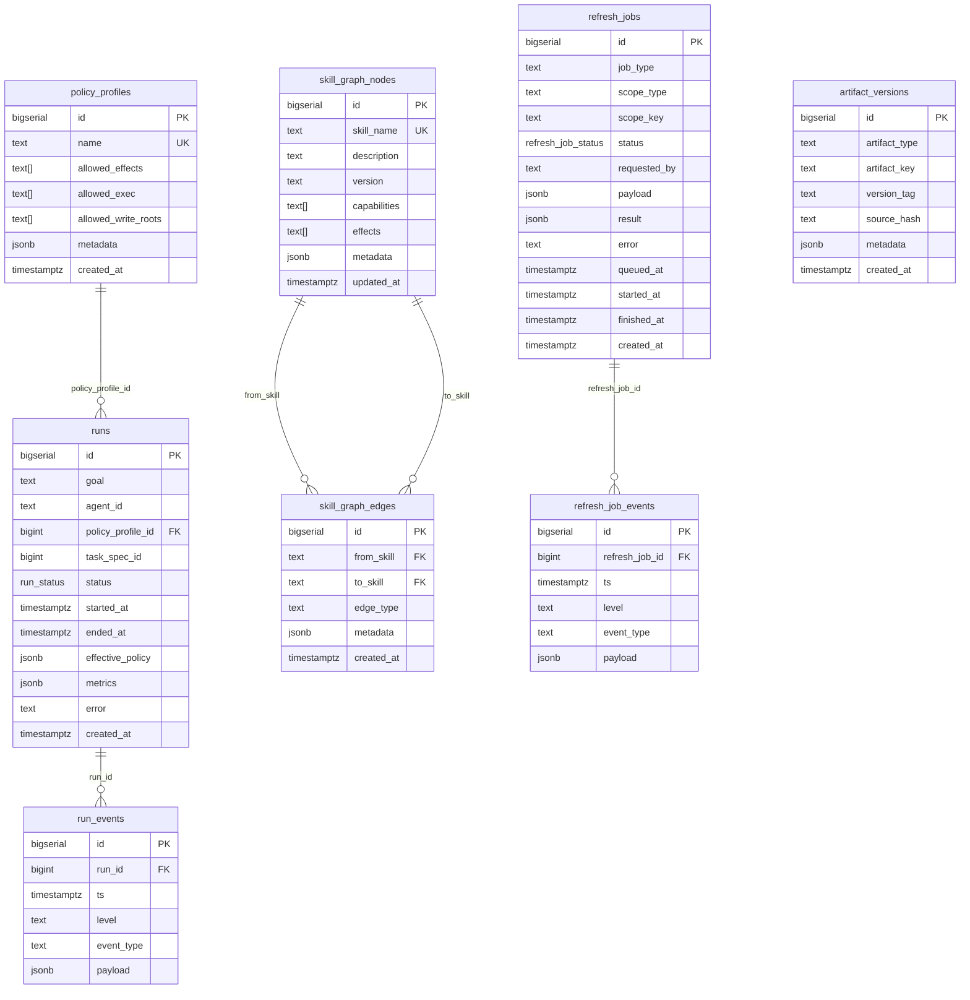

# Memory System Schema

## Entity Relationship Diagram

```mermaid
erDiagram
    agent_memories {
        bigserial id PK
        memory_type memory_type "working|episodic|semantic|procedural"
        varchar category
        varchar subcategory
        text title
        text content
        text content_hash
        text[] tags
        jsonb metadata
        varchar agent_id
        varchar session_id
        varchar user_id
        numeric importance_score "0-10"
        integer access_count
        numeric relevance_decay
        tsvector search_vector
        vector embedding "optional pgvector"
        timestamptz created_at
        timestamptz updated_at
        timestamptz accessed_at
        timestamptz deleted_at "soft delete"
    }

    memory_links {
        bigint source_id PK,FK
        bigint target_id PK,FK
        varchar link_type PK
        numeric strength "0-1"
        timestamptz created_at
    }

    working_memory {
        serial id PK
        varchar session_id
        varchar agent_id
        integer sequence_num
        varchar role
        text content
        jsonb metadata
        timestamptz created_at
        timestamptz expires_at "24h TTL"
    }

    soul_states {
        bigserial id PK
        bigint memory_id FK
        varchar user_id UK
        jsonb personality
        jsonb emotion
        jsonb buffers
        jsonb synthesis
        jsonb thresholds
        jsonb rate_limits
        text full_yaml
        timestamptz updated_at
    }

    insight_facets {
        bigserial id PK
        bigint memory_id FK
        varchar user_id
        varchar session_id
        varchar session_type
        varchar outcome
        text underlying_goal
        text brief_summary
        jsonb user_signals
        jsonb agent_performance
        jsonb proposed_adjustments
        text full_yaml
        timestamptz created_at
    }

    evolution_snapshots {
        bigserial id PK
        bigint memory_id FK
        varchar user_id
        varchar version_tag UK
        varchar target "soul|recipe|both"
        text trigger_reason
        jsonb changes
        text snapshot_data
        varchar rollback_from
        text full_yaml
        timestamptz created_at
    }

    user_preferences {
        bigserial id PK
        varchar user_id
        varchar pref_key
        text pref_value
        varchar source
        numeric confidence "0-1"
        timestamptz updated_at
    }

    session_summaries {
        bigserial id PK
        bigint memory_id FK
        varchar session_id UK
        varchar project_key
        text summary_text
        integer summary_version
        text source_hash
        jsonb metadata
        timestamptz created_at
        timestamptz updated_at
    }

    project_summaries {
        bigserial id PK
        bigint memory_id FK
        varchar project_key UK
        text summary_text
        integer summary_version
        text source_hash
        jsonb metadata
        timestamptz created_at
        timestamptz updated_at
    }

    context_rollups {
        bigserial id PK
        bigint memory_id FK
        varchar scope_type
        varchar scope_key
        varchar rollup_key
        text rollup_value
        varchar source
        numeric confidence
        timestamptz updated_at
    }

    behavior_sources {
        bigserial id PK
        varchar skill_id
        text source_path
        varchar source_kind
        text content_hash
        varchar parser_version
        varchar status
        timestamptz last_seen_at
        timestamptz last_parsed_at
    }

    behavior_nodes {
        bigserial id PK
        bigint source_id FK
        varchar skill_id
        varchar node_type
        text node_key
        text title
        text description
    }

    behavior_edges {
        bigserial id PK
        bigint source_id FK
        bigint from_node_id FK
        bigint to_node_id FK
        varchar edge_type
        text label
        numeric confidence
    }

    behavior_snapshots {
        bigserial id PK
        bigint memory_id FK
        varchar skill_id
        varchar snapshot_tag UK
        jsonb graph_json
        text mermaid
        jsonb source_hash_set
        timestamptz created_at
    }

    agent_tasks {
        bigserial id PK
        text task_key UK
        text title
        text description
        task_status status "open|in_progress|blocked|deferred|closed|tombstone"
        smallint priority "0-4"
        varchar assignee
        varchar created_by
        jsonb metadata
        timestamptz created_at
        timestamptz updated_at
        timestamptz closed_at
        timestamptz deleted_at
    }

    task_links {
        bigserial id PK
        bigint from_task_id FK
        bigint to_task_id FK
        task_link_type link_type "blocks|parent_child|related|..."
        jsonb metadata
        timestamptz created_at
    }

    blocked_tasks_cache {
        bigint task_id PK,FK
        bigint blocker_task_id
        text reason
        timestamptz updated_at
    }

    task_memory_links {
        bigint task_id PK,FK
        bigint memory_id PK,FK
        text link_type PK
        timestamptz created_at
    }

    agent_memories ||--o{ memory_links : "source_id"
    agent_memories ||--o{ memory_links : "target_id"
    agent_memories ||--o| soul_states : "memory_id"
    agent_memories ||--o{ insight_facets : "memory_id"
    agent_memories ||--o{ evolution_snapshots : "memory_id"
    agent_memories ||--o{ session_summaries : "memory_id"
    agent_memories ||--o{ project_summaries : "memory_id"
    agent_memories ||--o{ context_rollups : "memory_id"
    agent_memories ||--o{ behavior_snapshots : "memory_id"
    agent_memories ||--o{ task_memory_links : "memory_id"
    behavior_sources ||--o{ behavior_nodes : "source_id"
    behavior_sources ||--o{ behavior_edges : "source_id"
    behavior_nodes ||--o{ behavior_edges : "from_node_id"
    behavior_nodes ||--o{ behavior_edges : "to_node_id"
    agent_tasks ||--o{ task_links : "from_task_id"
    agent_tasks ||--o{ task_links : "to_task_id"
    agent_tasks ||--o| blocked_tasks_cache : "task_id"
    agent_tasks ||--o{ task_memory_links : "task_id"
```

## Architecture Layers

```mermaid
flowchart TD
    subgraph Plugin["Plugin Layer (skill-system-memory.js v4)"]
        compact["Compaction Hook"]
        typedQ["queryTypedContext()"]
        searchQ["queryRelevantMemories()"]
        compact --> typedQ & searchQ
    end

    subgraph Typed["Typed Sub-Tables Layer"]
        ss["soul_states<br/>(1 per user, UPSERT)"]
        if_t["insight_facets<br/>(append-only log)"]
        es["evolution_snapshots<br/>(versioned, append)"]
        up["user_preferences<br/>(key-value, UPSERT)"]
        ssum["session_summaries<br/>(1 per session)"]
        psum["project_summaries<br/>(1 per project)"]
        cr["context_rollups<br/>(scope-aware injected bundles)"]
        bs["behavior_sources<br/>(canonical file tracking)"]
        bn["behavior_nodes<br/>(typed graph nodes)"]
        be["behavior_edges<br/>(typed graph edges)"]
        bsn["behavior_snapshots<br/>(versioned graph projections)"]
    end

    subgraph Core["Core Memory Layer"]
        am["agent_memories<br/>(general log)"]
        ml["memory_links<br/>(graph edges)"]
        wm["working_memory<br/>(session TTL)"]
    end

    subgraph Tasks["Task Memory Layer"]
        at["agent_tasks"]
        tl["task_links<br/>(blocks, parent_child, ...)"]
        btc["blocked_tasks_cache<br/>(auto-rebuilt)"]
        tml["task_memory_links"]
    end

    subgraph Functions["Key Functions"]
        direction LR
        store["store_memory()"]
        search["search_memories()"]
        vec["search_memories_vector()"]
        ctx["get_agent_context()"]
        decay["apply_memory_decay()"]
        prune["prune_stale_memories()"]
        health["memory_health_check()"]
    end

    typedQ --> ctx
    searchQ --> search
    ctx --> ss & up & if_t & cr

    store --> am
    ss & if_t & es -.->|"dual-write via<br/>wrapper functions"| am
    ssum & psum & cr & bsn -.->|"summary / projection<br/>records"| am
    at --> tl & btc
    tml --> am & at

    classDef plugin fill:#ede9fe,stroke:#7c3aed,stroke-width:2px,color:#4c1d95
    classDef typed fill:#dbeafe,stroke:#3b82f6,stroke-width:2px,color:#1e40af
    classDef core fill:#f0fdf4,stroke:#22c55e,stroke-width:2px,color:#166534
    classDef task fill:#fef3c7,stroke:#f59e0b,stroke-width:2px,color:#92400e
    classDef func fill:#fce7f3,stroke:#ec4899,stroke-width:2px,color:#9d174d

    class compact,typedQ,searchQ plugin
    class ss,if_t,es,up,ssum,psum,cr,bs,bn,be,bsn typed
    class am,ml,wm core
    class at,tl,btc,tml task
    class store,search,vec,ctx,decay,prune,health func
```

## Function Reference

### Core Functions

| Function | Layer | Description |
|---|---|---|
| `store_memory(type, category, tags, title, content, ...)` | Core | Insert or deduplicate by content_hash |
| `search_memories(query, types, categories, tags, ...)` | Core | FTS + trigram + importance weighted search |
| `search_memories_vector(embedding, ...)` | Core | Cosine similarity search (requires pgvector) |
| `apply_memory_decay()` | Core | Decay `relevance_decay` for unaccessed episodic memories |
| `prune_stale_memories(age_days, max_score, max_hits)` | Core | Soft-delete old low-importance memories |
| `memory_health_check()` | Core | Total count, avg importance, stale count |

### Typed Write Functions (dual-write: typed table + agent_memories)

| Function | Target Table | Mode |
|---|---|---|
| `upsert_soul_state(user, yaml, personality, emotion, ...)` | `soul_states` | UPSERT (1 per user) |
| `insert_insight_facet(user, session_id, yaml, ...)` | `insight_facets` | INSERT (append) |
| `insert_evolution_snapshot(user, version_tag, target, ...)` | `evolution_snapshots` | INSERT (append) |
| `upsert_user_preference(user, key, value, source, confidence)` | `user_preferences` | UPSERT (per user+key) |

### Typed Read Functions

| Function | Returns |
|---|---|
| `get_soul_state(user)` | Single row: personality, emotion, synthesis, full_yaml |
| `get_recent_facets(user, limit)` | Recent insight facets with signals and performance |
| `get_evolution_history(user, limit)` | Evolution snapshots ordered by created_at DESC |
| `get_user_preferences(user)` | All preference key-value pairs for user |
| `get_agent_context(user, facet_limit)` | Aggregated: soul personality/emotion + prefs + recent facet summaries |

### Task Layer Functions

| Function | Description |
|---|---|
| `claim_task(task_id, assignee)` | Atomically claim an open, unblocked task |
| `rebuild_blocked_tasks_cache()` | Recompute transitive blockers via recursive CTE |

## Indexes

| Index | Table | Type | Purpose |
|---|---|---|---|
| `idx_am_type` | agent_memories | B-tree | Filter by memory_type |
| `idx_am_category` | agent_memories | B-tree | Filter by category |
| `idx_am_tags` | agent_memories | GIN | Array overlap (`&&`) queries |
| `idx_am_fts` | agent_memories | GIN | Full-text search on search_vector |
| `idx_am_importance` | agent_memories | B-tree | Sort by importance + recency |
| `idx_am_hash` | agent_memories | B-tree | Content deduplication |
| `idx_am_meta` | agent_memories | GIN | JSONB metadata queries |
| `idx_am_trgm_title` | agent_memories | GIN (pg_trgm) | Fuzzy title matching |
| `idx_am_trgm_body` | agent_memories | GIN (pg_trgm) | Fuzzy content matching |
| `idx_ss_user` | soul_states | B-tree UNIQUE | One soul state per user |
| `idx_if_user` | insight_facets | B-tree | Recent facets per user |
| `idx_es_version` | evolution_snapshots | B-tree UNIQUE | Version tag lookup |
| `idx_up_user_key` | user_preferences | B-tree UNIQUE | Preference UPSERT |

## Triggers

| Trigger | Event | Action |
|---|---|---|
| `trig_update_memory_metadata` | BEFORE INSERT/UPDATE on agent_memories | Rebuild search_vector, content_hash, updated_at |
| `trig_validate_memory_type` | BEFORE INSERT/UPDATE on agent_memories | Enforce working→session_id, procedural→importance≥7 |
| `trg_tasks_touch` | BEFORE UPDATE on agent_tasks | Auto-update updated_at, set closed_at on close |
| `trg_rebuild_on_task_update` | AFTER UPDATE on agent_tasks | Rebuild blocked cache on status boundary crossing |
| `trg_rebuild_on_task_links_change` | AFTER INSERT/DELETE/UPDATE on task_links | Rebuild blocked cache on link changes |

## `skill_system` Schema (Global Control Plane)

### `skill_system` Tables

| Table | Purpose |
|---|---|
| `policy_profiles` | Policy allowlists for skill effects and execution roots |
| `runs` | High-level execution records |
| `run_events` | Step-level observability events |
| `skill_graph_nodes` | Global skill dependency graph nodes |
| `skill_graph_edges` | Global skill dependency graph edges |
| `refresh_jobs` | Queued refresh / rebuild jobs |
| `refresh_job_events` | Per-job lifecycle and log events |
| `artifact_versions` | Version registry for generated artifacts |
