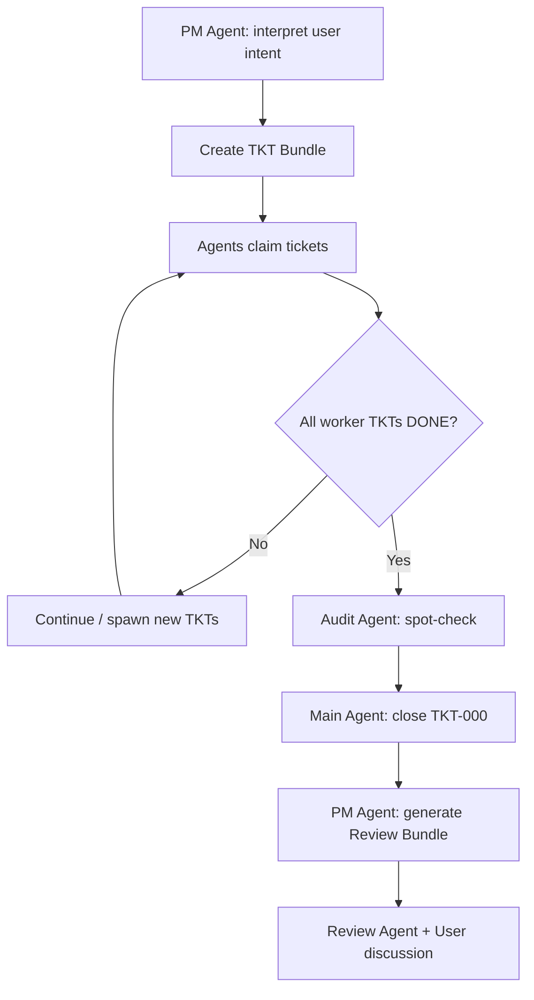

# Skill System TKT

Single source of truth for all ticket operations across the skill system.

## Two Backends, One Lifecycle

```
Backend 1: Filesystem Bundles (tkt.sh)
  Project-level work management.
  Roadmap → Bundle → Tickets (YAML files in .tkt/)
  Use for: PM-driven decomposition, multi-agent bundles, review generation.

Backend 2: DB Durable Tickets (tickets.py)
  Session-level lifecycle management.
  Intake → Claim → Work → Block/Close (Postgres agent_memories)
  Use for: claim arbitration, session loops, scope enforcement, refresh.
```

Both backends share the same conceptual lifecycle:
```
OPEN → CLAIMED → IN_PROGRESS → DONE/BLOCKED/FAILED/CLOSED
```

## Core Concepts

```
Roadmap (project-level, maintained by PM Agent)
 └─ TKT Bundle (a unit of deliverable work)
     ├─ TKT-000  Integrate   (claimed by Main Agent — coordinates bundle)
     ├─ TKT-001  Worker      (claimed by any agent — actual work)
     ├─ TKT-002  Worker      (claimed by any agent — actual work)
     ├─ TKT-...  Worker      (can be added mid-flight)
     └─ TKT-A00  Audit       (spot-check ticket — random quality verification)
```

### Roles

| Role | Who | Responsibility |
|------|-----|----------------|
| **PM Agent** | Plan/Review agent | Interprets user intent → maintains roadmap → creates bundles → reviews results |
| **Main Agent** | Agent that claims TKT-000 | Coordinates the bundle, integrates outputs, closes TKT-000 when all work is done |
| **Worker Agent** | Any agent that claims a worker TKT | Executes the ticket's task, reports result |
| **Audit Agent** | Agent that claims TKT-A00 | Randomly spot-checks engineering quality across the project |

### Ticket States

```
OPEN → CLAIMED → IN_PROGRESS → DONE
                              → BLOCKED (needs new TKT or intervention)
                              → FAILED  (requires retry or escalation)
```

### Bundle Lifecycle



## Configuration

All runtime settings are in `config/tkt.yaml`. Config is the single source of truth — values in this document are documentation only.

See: `../../config/tkt.yaml`

## Data Model

### Filesystem Backend (.tkt/)

```
.tkt/
├── roadmap.yaml              # Project-level roadmap
├── bundles/
│   ├── B-001/
│   │   ├── bundle.yaml       # Bundle metadata
│   │   ├── TKT-000.yaml     # Integrate ticket
│   │   ├── TKT-001.yaml     # Worker ticket
│   │   ├── TKT-A00.yaml     # Audit ticket
│   │   └── review.yaml      # Generated after bundle closes
│   └── B-002/
│       └── ...
└── history.log               # Append-only event log
```

### DB Backend (agent_memories)

Durable tickets stored via `agent_memories` with metadata fields:
- `ticket_id`, `title`, `summary`, `status`
- `claimed_by_session`, `claimed_at`, `closed_at`
- `batch_id`, `queue_order`, `ticket_type` (WORKER/INTEGRATOR)
- `task_provenance` (workflow/verification/legacy)

## Operations

### Filesystem Bundle Operations (tkt.sh)

#### `init-roadmap`
Initialize the `.tkt/` directory and `roadmap.yaml` for a project.

```bash
bash "<this-skill-dir>/scripts/tkt.sh" init-roadmap --project "<name>"
```

#### `create-bundle`
PM Agent interprets user intent and creates a new TKT bundle with tickets.

```bash
bash "<this-skill-dir>/scripts/tkt.sh" create-bundle --goal "<goal>" [--track "<name>"] [--source-plan "<file>"] [--worktree] [--carryover B-001]
```

- `--track`: optional workstream label persisted to `bundle.yaml` (`track` field)
- `--source-plan`: optional source plan path persisted to `bundle.yaml` (`source_plan` field)
- `--worktree`: create `.worktrees/B-NNN` and persist `worktree_path` / `worktree_branch`
- `--carryover`: import worker tickets from another bundle's `carryover.yaml`

**Procedure**: `scripts/create-bundle.md`

#### `claim-ticket` (filesystem)

```bash
bash "<this-skill-dir>/scripts/tkt.sh" claim --bundle B-001 --ticket TKT-001 --agent "<agent-id>"
```

#### `update-ticket`

```bash
bash "<this-skill-dir>/scripts/tkt.sh" update --bundle B-001 --ticket TKT-001 --status done --summary "<result>" --evidence "<proof>"
bash "<this-skill-dir>/scripts/tkt.sh" update --bundle B-001 --ticket TKT-001 --status blocked --reason "<why blocked>"
```

- `--evidence` / `--evidence-file`: required when `--status done`; persisted to `result.evidence`
- `--reason`: required when `--status blocked`; persisted to `result.notes`
- valid transitions are enforced; `claim` handles `open|blocked -> claimed`

#### `add-ticket`

```bash
bash "<this-skill-dir>/scripts/tkt.sh" add --bundle B-001 --type worker --title "<title>" --description "<desc>" [--skills "skill-a,skill-b"] [--wave 2] [--qa-scenarios "run pytest,inspect output"]
```

- `--skills`: optional comma-separated skill names stored as YAML list metadata
- `--wave`: optional numeric wave value for execution ordering metadata
- `--qa-scenarios`: optional comma-separated QA checklist stored as YAML list metadata

#### `bundle-status`

```bash
bash "<this-skill-dir>/scripts/tkt.sh" status --bundle B-001
```

#### `close-bundle`

```bash
bash "<this-skill-dir>/scripts/tkt.sh" close --bundle B-001 [--merge]
```

Close-time gates:
- structural validation via `python3 spec/validate_repo_structural.py`
- optional `config/tkt.yaml` `close_gate.command`
- executable acceptance criteria (`{type: command, ...}` objects)
- audit ticket must be claimed and `done`
- audit claimant must differ from any worker claimant
- worktree-backed bundles must be clean before close

Close-time artifacts:
- `review.yaml` auto-fills `evidence_summary` and `acceptance_results`
- failed executable acceptance criteria generate `carryover.yaml`
- `--merge` merges `worktree_branch` into the current branch and removes the worktree after a successful close

#### `express`

```bash
bash "<this-skill-dir>/scripts/tkt.sh" express close EXP-001 --evidence "<proof>"
```

- `express close` requires `--evidence` or `--evidence-file`
- `files_changed > 3` upgrades the express ticket into a bundle worker ticket while preserving evidence

#### `list-bundles`

```bash
bash "<this-skill-dir>/scripts/tkt.sh" list
```

#### `roadmap-transition`
Transition roadmap to a new stage with gate checks.

```bash
bash "<this-skill-dir>/scripts/tkt.sh" roadmap-transition --stage active --reason "bundles created"
bash "<this-skill-dir>/scripts/tkt.sh" roadmap-transition --stage done --reason "all goals met" [--force]
```

Gate checks:
- `planning → active`: At least one bundle must exist
- `* → done`: All bundles must be closed/archived
- Invalid transitions are rejected unless `--force` is used

#### `roadmap-status`
Show roadmap stage, bundle summary, and allowed transitions.

```bash
bash "<this-skill-dir>/scripts/tkt.sh" roadmap-status
```

### DB Ticket Lifecycle Operations (tickets.py)

#### `intake-ticket`
Create or sync a durable workflow ticket from user-facing intake (note/note_tasks.md).

```bash
python3 "<this-skill-dir>/scripts/tickets.py" intake-ticket --from-note-tasks
python3 "<this-skill-dir>/scripts/tickets.py" intake-ticket --ticket-id TKT-001 --title "..." --summary "..."
```

#### `list-tickets` (DB)

```bash
python3 "<this-skill-dir>/scripts/tickets.py" list-tickets [--unresolved-only] [--batch-id BATCH-001]
```

#### `claim-ticket` (DB)
Session-based claiming with conflict-safe advisory locks.

```bash
python3 "<this-skill-dir>/scripts/tickets.py" claim-ticket --ticket-id TKT-001 [--session-id ses_xxx]
```

#### `block-ticket`

```bash
python3 "<this-skill-dir>/scripts/tickets.py" block-ticket --ticket-id TKT-001 [--reason "blocker"]
```

#### `close-ticket` (DB)
Runs refresh-new-tasks before closing. Refuses integrator closure if new claimable tasks exist.

```bash
python3 "<this-skill-dir>/scripts/tickets.py" close-ticket [--ticket-id TKT-001] --session-id ses_xxx
```

#### `check-open-tickets`

```bash
python3 "<this-skill-dir>/scripts/tickets.py" check-open-tickets [--session-id ses_xxx]
```

#### `claim-summary`
Report batch/session claim ownership with collaboration policy snapshot.

```bash
python3 "<this-skill-dir>/scripts/tickets.py" claim-summary [--session-id ses_xxx] [--batch-id BATCH-001]
```

#### `session-loop`
Run the legal worker loop for one session: refresh → resume/claim → work → next.

```bash
python3 "<this-skill-dir>/scripts/tickets.py" session-loop --session-id ses_xxx [--batch-id BATCH-001]
```

#### `refresh-new-tasks`
Re-read `note/note_tasks.md` `### New` section and ingest newly added work.

```bash
python3 "<this-skill-dir>/scripts/tickets.py" refresh-new-tasks [--batch-id BATCH-001]
```

#### `refresh-review-inbox`
Parse the review inbox and ingest inbox-derived tickets.

```bash
python3 "<this-skill-dir>/scripts/tickets.py" refresh-review-inbox [--batch-id BATCH-001]
```

#### `startup-flow`
Report the current startup/claim-loop context from zero to review-agent handoff.

```bash
python3 "<this-skill-dir>/scripts/tickets.py" startup-flow [--session-id ses_xxx]
```

#### `integrator-closure-report`
Report whether the integrator ticket can legally close the batch.

```bash
python3 "<this-skill-dir>/scripts/tickets.py" integrator-closure-report --session-id ses_xxx
```

#### `check-ticket-scope`
Report whether the changed-file set stays inside the claimed ticket scope.

```bash
python3 "<this-skill-dir>/scripts/tickets.py" check-ticket-scope --ticket-id TKT-001
```

## PM Agent Workflow

1. **Interpret Intent** — Parse what the user wants, map to roadmap goals
2. **Create Bundle** — Break work into tickets (000 + workers + audit)
3. **Monitor** — Track bundle progress, unblock agents
4. **Review** — After bundle closes, generate review bundle
5. **Discuss** — Present findings to user, gather feedback
6. **Update Roadmap** — Reflect completed work and new directions

### PM Agent Decision Matrix

| User Says | PM Action |
|-----------|-----------|
| New feature / task request | Create new goal + bundle |
| "What's the status?" | Run `bundle-status` or `list-tickets` |
| "I changed my mind about X" | Update/close relevant tickets, adjust roadmap |
| "Review the work" | Generate review bundle, present findings |
| "Add more work to current task" | `add-ticket` to active bundle |
| Vague / ambiguous request | Clarify intent before creating tickets |

## Method Laws

- **one_ticket_at_a_time**: One session may hold at most one active claimed ticket.
- **keep_picking_open_stale**: Before ending the round, if OPEN or STALE worker tickets remain claimable, continue claiming the next one.
- **integrator_only_closure**: Only the integrator ticket may declare batch closure; worker tickets may close themselves but never the batch.

## Collaboration Policy

- **question_tool_first**: Prefer the question tool for branch decisions when available. Shape: 2-4 options, one recommended, single choice. Fallback: structured single-choice prompt with the same shape.
- **subagent_scope**: Subagents must stay inside the currently claimed ticket scope.
- **cross_ticket_loophole**: Forbidden — subagents cannot cross ticket boundaries.

### Subagent Playbook

**Preferred use cases** (subagents encouraged):
- Parallel independent subtasks inside the currently claimed ticket
- Narrow research or grep work that unblocks a claimed ticket decision
- Isolated read-only verification slices for a claimed ticket

**Non-use cases** (do NOT use subagents for):
- Single cohesive code path in one local module
- Cross-ticket work or anything that widens scope beyond the claimed ticket
- Performative delegation when the parent session already has enough context

**Reporting contract** — every subagent invocation must report:
- `subagent_name` — identifier
- `purpose` — why this subagent was spawned
- `ticket_scope` — which ticket it operates within
- `write_capability_used` — whether it wrote files
- `why_subagent_was_needed_or_not_needed` — justification

### Roadmap Stage Transitions

Valid stages: `planning → active → review → done → archived`

| From | Allowed To | Gate Checks |
|------|-----------|-------------|
| planning | active, archived | At least one bundle must exist for `active` |
| active | review, blocked, archived | — |
| review | done, active, archived | All bundles must be closed/archived for `done` |
| blocked | active, archived | — |
| done | archived | — |

Transitions require `--reason` and are logged in `roadmap.yaml` stage_history.
Use `--force` to bypass gate checks (logged but not recommended).

## Concurrency

- Filesystem: Lock file (`.tkt/bundles/B-NNN/.lock`)
- DB: PostgreSQL advisory locks for conflict-safe claiming

## Integration Notes

### opencode + OMO

- **opencode**: Agents execute via opencode runtime, agent-id maps to opencode session
- **OMO**: Orchestration layer manages agent lifecycle and ticket claiming
- Filesystem backend is git-friendly, no DB dependency for basic operation
- DB backend requires PostgreSQL (via skill-system-memory)

```skill-manifest
{
  "schema_version": "2.0",
  "id": "skill-system-tkt",
  "version": "2.0.0",
  "capabilities": [
     "tkt-init", "tkt-create-bundle", "tkt-claim", "tkt-update", "tkt-add",
     "tkt-status", "tkt-close", "tkt-review", "tkt-list", "tkt-express",
     "tkt-roadmap-transition", "tkt-roadmap-status",
    "tkt-intake", "tkt-claim-db", "tkt-block", "tkt-close-db",
    "tkt-check-open", "tkt-claim-summary", "tkt-session-loop",
    "tkt-refresh-new", "tkt-refresh-inbox", "tkt-startup-flow",
    "tkt-integrator-closure", "tkt-check-scope",
    "pm-interpret", "pm-roadmap"
  ],
  "effects": ["fs.read", "fs.write", "db.read", "db.write", "proc.exec"],
  "operations": {
    "init-roadmap": {
      "description": "Initialize .tkt/ directory and roadmap.yaml",
      "input": { "project": { "type": "string", "required": true } },
      "output": { "description": "Initialized roadmap path", "fields": { "roadmap_path": "string" } },
      "entrypoints": {
        "unix": ["bash", "{skill_dir}/scripts/tkt.sh", "init-roadmap", "--project", "{project}"]
      }
    },
    "create-bundle": {
      "description": "PM Agent creates a TKT bundle from user intent",
      "input": {
        "goal": { "type": "string", "required": true },
        "context": { "type": "string", "required": false },
        "track": { "type": "string", "required": false },
        "source_plan": { "type": "string", "required": false },
        "worktree": { "type": "boolean", "required": false },
        "carryover": { "type": "string", "required": false }
      },
      "output": { "description": "Bundle ID and ticket list", "fields": { "bundle_id": "string", "tickets": "array" } },
      "entrypoints": {
        "unix": ["bash", "{skill_dir}/scripts/tkt.sh", "create-bundle", "--goal", "{goal}", "--track", "{track}", "--source-plan", "{source_plan}"],
        "agent": "scripts/create-bundle.md"
      }
    },
    "claim": {
      "description": "Claim a filesystem ticket within a bundle.",
      "input": {
        "bundle": { "type": "string", "required": true },
        "ticket": { "type": "string", "required": true },
        "agent": { "type": "string", "required": true }
      },
      "output": { "description": "Claim result", "fields": { "claimed": "boolean", "ticket": "string" } },
      "entrypoints": {
        "unix": ["bash", "{skill_dir}/scripts/tkt.sh", "claim", "--bundle", "{bundle}", "--ticket", "{ticket}", "--agent", "{agent}"]
      }
    },
    "update": {
      "description": "Update a filesystem ticket status and summary.",
      "input": {
        "bundle": { "type": "string", "required": true },
        "ticket": { "type": "string", "required": true },
        "status": { "type": "string", "required": true },
        "summary": { "type": "string", "required": false },
        "evidence": { "type": "string", "required": false },
        "evidence_file": { "type": "string", "required": false },
        "reason": { "type": "string", "required": false }
      },
      "output": { "description": "Update result", "fields": { "ticket_id": "string", "new_status": "string" } },
      "entrypoints": {
        "unix": ["bash", "{skill_dir}/scripts/tkt.sh", "update", "--bundle", "{bundle}", "--ticket", "{ticket}", "--status", "{status}"]
      }
    },
    "add": {
      "description": "Add a filesystem worker ticket with structured metadata.",
      "input": {
        "bundle": { "type": "string", "required": true },
        "title": { "type": "string", "required": true },
        "description": { "type": "string", "required": false },
        "category": { "type": "string", "required": false },
        "effort_estimate": { "type": "string", "required": false },
        "skills": { "type": "string", "required": false },
        "wave": { "type": "number", "required": false },
        "qa_scenarios": { "type": "string", "required": false },
        "depends_on": { "type": "string", "required": false },
        "source_plan": { "type": "string", "required": false },
        "source_ticket_index": { "type": "number", "required": false },
        "acceptance": { "type": "string", "required": false }
      },
      "output": { "description": "Added ticket result", "fields": { "ticket_id": "string", "bundle": "string" } },
      "entrypoints": {
        "unix": ["bash", "{skill_dir}/scripts/tkt.sh", "add", "--bundle", "{bundle}", "--title", "{title}"]
      }
    },
    "express": {
      "description": "Manage express tickets without requiring a bundle.",
      "input": {
        "action": { "type": "string", "required": false },
        "title": { "type": "string", "required": false },
        "acceptance": { "type": "string", "required": false },
        "category": { "type": "string", "required": false },
        "effort_estimate": { "type": "string", "required": false },
        "wave": { "type": "number", "required": false },
        "source_plan": { "type": "string", "required": false },
        "source_ticket_index": { "type": "number", "required": false },
        "ticket_id": { "type": "string", "required": false },
        "agent": { "type": "string", "required": false },
        "files_changed": { "type": "number", "required": false },
        "evidence": { "type": "string", "required": false },
        "evidence_file": { "type": "string", "required": false }
      },
      "output": { "description": "Express ticket result", "fields": { "ticket_id": "string", "status": "string" } },
      "entrypoints": {
        "unix": ["bash", "{skill_dir}/scripts/tkt.sh", "express"]
      }
    },
    "bundle-status": {
      "description": "Show bundle status with all tickets",
      "input": { "bundle": { "type": "string", "required": true } },
      "output": { "description": "Bundle status report", "fields": { "bundle": "object" } },
      "entrypoints": {
        "unix": ["bash", "{skill_dir}/scripts/tkt.sh", "status", "--bundle", "{bundle}"]
      }
    },
    "close-bundle": {
      "description": "Close bundle after worker completion and verification gates.",
      "input": { "bundle": { "type": "string", "required": true }, "merge": { "type": "boolean", "required": false } },
      "output": { "description": "Close result", "fields": { "closed": "boolean", "review_path": "string" } },
      "entrypoints": {
        "unix": ["bash", "{skill_dir}/scripts/tkt.sh", "close", "--bundle", "{bundle}"]
      }
    },
    "list-bundles": {
      "description": "List all bundles and their status",
      "input": {},
      "output": { "description": "Bundle list", "fields": { "bundles": "array" } },
      "entrypoints": {
        "unix": ["bash", "{skill_dir}/scripts/tkt.sh", "list"]
      }
    },
    "roadmap-transition": {
      "description": "Transition roadmap to a new stage with gate checks",
      "input": {
        "stage": { "type": "string", "required": true },
        "reason": { "type": "string", "required": true },
        "force": { "type": "boolean", "required": false }
      },
      "output": { "description": "Transition result", "fields": { "transition": "string", "new_stage": "string" } },
      "entrypoints": {
        "unix": ["bash", "{skill_dir}/scripts/tkt.sh", "roadmap-transition", "--stage", "{stage}", "--reason", "{reason}"]
      }
    },
    "roadmap-status": {
      "description": "Show roadmap stage, bundle summary, and allowed transitions",
      "input": {},
      "output": { "description": "Roadmap status", "fields": { "project": "string", "stage": "string", "allowed_transitions": "array" } },
      "entrypoints": {
        "unix": ["bash", "{skill_dir}/scripts/tkt.sh", "roadmap-status"]
      }
    },
    "generate-review": {
      "description": "Generate review bundle post-closure",
      "input": { "bundle": { "type": "string", "required": true } },
      "output": { "description": "Review bundle", "fields": { "review_path": "string" } },
      "entrypoints": { "agent": "scripts/generate-review.md" }
    },
    "intake-ticket": {
      "description": "Create or sync a durable ticket from note_tasks intake",
      "input": {
        "ticket_id": { "type": "string", "required": false },
        "title": { "type": "string", "required": false },
        "from_note_tasks": { "type": "boolean", "required": false }
      },
      "output": { "description": "Canonical ticket record", "fields": { "ticket": "object" } },
      "entrypoints": {
        "unix": ["python3", "{skill_dir}/scripts/tickets.py", "intake-ticket"]
      }
    },
    "list-tickets": {
      "description": "List durable workflow tickets",
      "input": {
        "unresolved_only": { "type": "boolean", "required": false },
        "batch_id": { "type": "string", "required": false }
      },
      "output": { "description": "Ticket list", "fields": { "tickets": "array" } },
      "entrypoints": {
        "unix": ["python3", "{skill_dir}/scripts/tickets.py", "list-tickets"]
      }
    },
    "claim-ticket": {
      "description": "Claim a ticket for the current session (DB-backed, conflict-safe)",
      "input": {
        "ticket_id": { "type": "string", "required": true },
        "session_id": { "type": "string", "required": true }
      },
      "output": { "description": "Claimed ticket", "fields": { "ticket": "object" } },
      "entrypoints": {
        "unix": ["python3", "{skill_dir}/scripts/tickets.py", "claim-ticket", "--ticket-id", "{ticket_id}", "--session-id", "{session_id}"]
      }
    },
    "block-ticket": {
      "description": "Mark a ticket as blocked",
      "input": {
        "ticket_id": { "type": "string", "required": true },
        "reason": { "type": "string", "required": false }
      },
      "output": { "description": "Blocked ticket", "fields": { "ticket": "object" } },
      "entrypoints": {
        "unix": ["python3", "{skill_dir}/scripts/tickets.py", "block-ticket", "--ticket-id", "{ticket_id}"]
      }
    },
    "close-ticket": {
      "description": "Close the currently claimed ticket (runs refresh first)",
      "input": {
        "session_id": { "type": "string", "required": true },
        "ticket_id": { "type": "string", "required": false },
        "resolution": { "type": "string", "required": false }
      },
      "output": { "description": "Closed ticket + refresh status", "fields": { "ticket": "object", "refresh_status": "object" } },
      "entrypoints": {
        "unix": ["python3", "{skill_dir}/scripts/tickets.py", "close-ticket", "--session-id", "{session_id}"]
      }
    },
    "check-open-tickets": {
      "description": "Report unresolved tickets",
      "input": { "session_id": { "type": "string", "required": false } },
      "output": { "description": "Open ticket report", "fields": { "report": "object" } },
      "entrypoints": {
        "unix": ["python3", "{skill_dir}/scripts/tickets.py", "check-open-tickets"]
      }
    },
    "claim-summary": {
      "description": "Batch/session claim ownership summary with collaboration policy",
      "input": {
        "session_id": { "type": "string", "required": false },
        "batch_id": { "type": "string", "required": false }
      },
      "output": { "description": "Claim summary", "fields": { "claim_summary": "object" } },
      "entrypoints": {
        "unix": ["python3", "{skill_dir}/scripts/tickets.py", "claim-summary"]
      }
    },
    "session-loop": {
      "description": "Run the legal worker loop for one session",
      "input": {
        "session_id": { "type": "string", "required": true },
        "batch_id": { "type": "string", "required": false }
      },
      "output": { "description": "Loop state", "fields": { "loop_state": "object" } },
      "entrypoints": {
        "unix": ["python3", "{skill_dir}/scripts/tickets.py", "session-loop", "--session-id", "{session_id}"]
      }
    },
    "refresh-new-tasks": {
      "description": "Re-read note_tasks ### New and ingest new work",
      "input": {
        "batch_id": { "type": "string", "required": false },
        "trigger_point": { "type": "string", "required": false }
      },
      "output": { "description": "Refresh status", "fields": { "refresh_status": "object" } },
      "entrypoints": {
        "unix": ["python3", "{skill_dir}/scripts/tickets.py", "refresh-new-tasks"]
      }
    },
    "refresh-review-inbox": {
      "description": "Parse review inbox and ingest inbox-derived tickets",
      "input": {
        "batch_id": { "type": "string", "required": false },
        "trigger_point": { "type": "string", "required": false }
      },
      "output": { "description": "Inbox refresh status", "fields": { "refresh_status": "object" } },
      "entrypoints": {
        "unix": ["python3", "{skill_dir}/scripts/tickets.py", "refresh-review-inbox"]
      }
    },
    "startup-flow": {
      "description": "Startup/claim-loop context from zero to review handoff",
      "input": {
        "session_id": { "type": "string", "required": false },
        "batch_id": { "type": "string", "required": false }
      },
      "output": { "description": "Startup context", "fields": { "startup_context": "object" } },
      "entrypoints": {
        "unix": ["python3", "{skill_dir}/scripts/tickets.py", "startup-flow"]
      }
    },
    "integrator-closure-report": {
      "description": "Report whether integrator can legally close the batch",
      "input": {
        "session_id": { "type": "string", "required": true },
        "ticket_id": { "type": "string", "required": false }
      },
      "output": { "description": "Closure legality report", "fields": { "closure_report": "object" } },
      "entrypoints": {
        "unix": ["python3", "{skill_dir}/scripts/tickets.py", "integrator-closure-report", "--session-id", "{session_id}"]
      }
    },
    "check-ticket-scope": {
      "description": "Report if changed files stay inside claimed ticket scope",
      "input": {
        "ticket_id": { "type": "string", "required": true }
      },
      "output": { "description": "Scope report (CLEAN or SCOPE_BREACH)", "fields": { "scope_report": "object" } },
      "entrypoints": {
        "unix": ["python3", "{skill_dir}/scripts/tickets.py", "check-ticket-scope", "--ticket-id", "{ticket_id}"]
      }
    }
  },
  "stdout_contract": {
    "last_line_json": true,
    "note": "tickets.py emits JSON on last line. tkt.sh emits JSON. Agent-executed procedures (create-bundle.md, generate-review.md) are non-stdout."
  }
}
```
